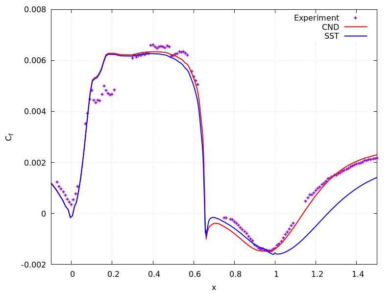
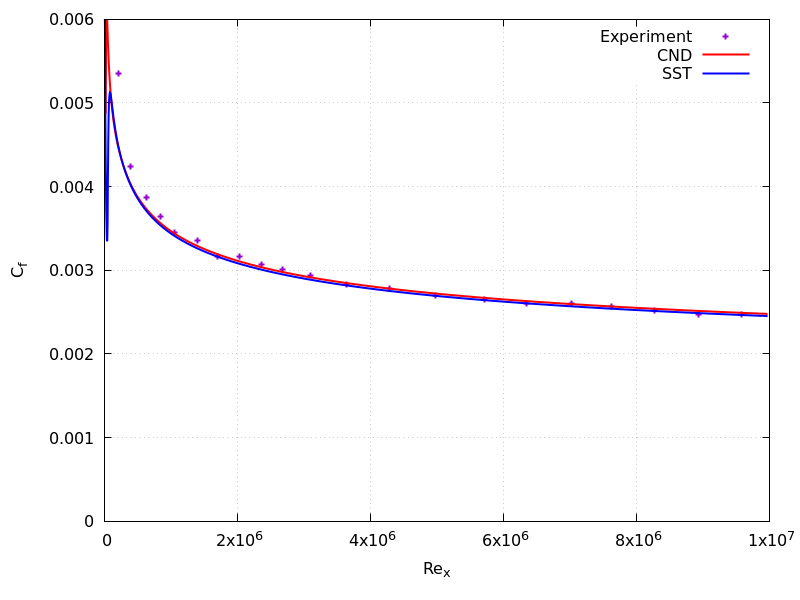

# OpenFOAM Implementation of The SST-CND Model 
## Overview
This is an OpenFOAM Implementation of the SST-CND model described in [this article](https://arxiv.org/ftp/arxiv/papers/2402/2402.16355.pdf). The SST-CND model is based on Menter's Shear-stress-transport model with a correction term for separated flow (especially separated shear layer) derived by machine learning method. The SST-CND model is tested on various 2D and 3D cases and shows good generalizability.

The implementation is tested on OpenFOAM-v2312 and works fine.

## Performance

## How to install
First, you should have OpenFOAM-v2312 installed on your system. Then you can follow the steps below to compile the model.

* Clone the repository to anywhere you want on your system (you can also just download the `zip` file from GitHub if you wish):
    ```
    git clone git@github.com:chairmanmao256/SST-CND-Turbulence-Model-for-OpenFOAM.git
    ```

* From the root of the repository, run the following commands:
    ```
    cd src/TurbulenceModels/incompressible
    wclean
    wmake
    cd ../compressible
    wclean
    wmake
    ```
    Note that after the compilation completed, the `.so` files are stored in `$FOAM_USER_LIBBIN`.
* If you want to use the model for your simulation:
    * add the following line to the `system/controlDict` file (just pick one of them depending on your case):
        ```
        // For incompressible flows
        lib(libCNDIncompressibleTurbulenceModels)

        // For compressible flows
        lib(libCNDCompressibleTurbulenceModels)
        ```
    * specify the turbulence model in `constant/turbulenceProperties`
        ```
        RASModel kOmegaSSTCND
        ```

## Run the tutorial cases
Two tutorial cases are included in the [cases](./cases) directory. They are the NASA hump (`cases/NASA-hump`) and the zero gradient flat plate (`cases/ZPG-flatPlate`). To run the tutorial cases, just type the following command in each case:
```shell
./Allrun.sh
```
Depending on your system, you might have to do some `chmod` stuffs before running the script to make or `.sh` files in the tutorial cases executable. The `Allrun.sh` script runs both the baseline SST model and the SST-CND model for the given case and compare their results.

After running the script, if you have `gnuplot` correctly installed on your system (`sudo apt-get install gnuplot`), you can reproduce the following images. The Cf distribution in the NASA hump case shows that the SST-CND model is able to predict a separation zone closer to the experiment. On the other hand, the Cf distribution in the ZPG flat plate case shows that the SST-CND model does not negatively impact the baseline SST model's performance in zero-pressure-gradient boundary layer.


